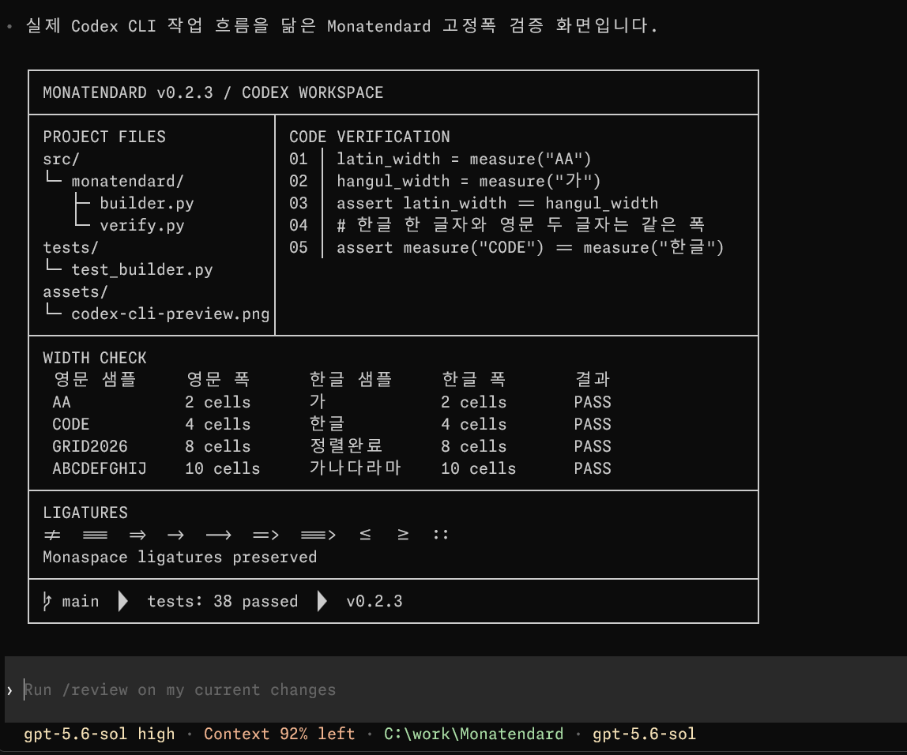

# Monatendard

**A Korean coding font that pairs Monaspace Neon with Pretendard.**

[Website & live preview](https://monatendard.github.io/) ·
[Download](https://monatendard.github.io/#download) ·
[한국어 README](README.ko.md)

Monatendard keeps the distinctive punctuation, ligatures, and character of
Monaspace Neon while adding the clear Korean texture of Pretendard. It is tuned
for mixed Korean and Latin code: every Hangul character occupies exactly two
Latin cells, with spacing that stays readable without feeling unnecessarily
wide.

## Compared with the Monaspace Neon Frozen source

An `outline` is the visible shape of a glyph. The `cell width` is the fixed
space reserved before the next character begins.

| Item | Monaspace Neon Frozen source | Monatendard |
|---|---:|---:|
| Coordinate system | `2000 units` | `2000 units` |
| Latin cell width | `1240`, `0.620em` | `1190`, `0.595em` |
| Standard Latin outline width | 100% | 92.5% |
| Latin vertical scale | 100% | 100% |
| Hangul/CJK outline scale | Not included | Up to 112% horizontal, 110% vertical |
| Hangul cell width | Not included | `2380`, exactly two Latin character widths |

<p align="center">
  
</p>

<p align="center">
  <sub>Monatendard Nerd Font Mono in Codex CLI on Windows Terminal</sub>
</p>

## Highlights

- Built from pinned Monaspace Neon 1.400 and Pretendard 1.3.9 sources
- Exact 1:2 Latin-to-Hangul cell alignment
- Balanced Korean spacing for comfortable reading in code and comments
- 14 styles across seven weights, with matching italics
- Optional `Monatendard Nerd Font Mono` family for terminal icons
- Reproducible builds from pinned, checksum-verified upstream sources

## Download and install

Download the latest package from the
[official website](https://monatendard.github.io/#download).

For Windows:

1. Choose **Desktop** for editors and general use, or **Desktop Nerd** for
   terminals with icon-powered prompts.
2. Extract the ZIP file.
3. Run `Install-Monatendard.ps1` in PowerShell.
4. Restart the application and select `Monatendard` or
   `Monatendard Nerd Font Mono`.

The installer works per user and does not require administrator privileges.
Matching uninstall scripts are included in each package.

### VS Code

Open **Settings (JSON)** and add:

```json
{
  "editor.fontFamily": "Monatendard, Consolas, monospace",
  "editor.fontLigatures": true
}
```

Restart VS Code after installing the font.

TTF files can also be installed manually on macOS and Linux. Automated
installers for those platforms are planned for a future release.

## Build from source

Building requires Python 3.11 or later and
[uv](https://docs.astral.sh/uv/).

```powershell
uv sync --all-groups
uv run monatendard fetch
uv run monatendard build --all
uv run monatendard verify --reproducible
uv run monatendard build-nerd --all
uv run monatendard verify --nerd --reproducible
```

### How Monatendard is built

1. Pin the Monaspace Neon Frozen, Pretendard, and Nerd Fonts sources and verify
   their SHA256 checksums.
2. Scale the Monaspace glyph outlines horizontally to 92.5% and center them in
   0.595em Latin cells, while fitting box-drawing, block, and Powerline glyphs
   to the cell edges so adjacent strokes remain continuous. Italic variants use
   the matching upright outlines for these connecting glyphs.
3. Scale Pretendard Hangul and CJK glyphs to 112% horizontally and 110%
   vertically, then merge them into cells exactly twice the Latin width.
4. Set the Monatendard family, style, fixed-pitch, version, and license
   metadata.
5. Generate desktop TTF files, web WOFF2 files, and `@font-face` CSS.
6. Optionally merge Nerd Fonts Symbols Only icons into single-width cells.
7. Verify glyph coverage, cell widths, ligatures, font metadata, and
   reproducible output before packaging.

See the [Korean README](README.ko.md) for the complete build, packaging, and
release workflow.

## Upstream fonts and license

Monatendard is built from
[Monaspace Neon](https://github.com/githubnext/monaspace) and
[Pretendard](https://github.com/orioncactus/pretendard). The optional terminal
variant adds [Nerd Fonts Symbols Only](https://github.com/ryanoasis/nerd-fonts).

The font software is distributed under the SIL Open Font License 1.1. Nerd
Fonts symbols are distributed under the MIT License. See [LICENSE](LICENSE) and
[third-party notices](licenses/THIRD_PARTY_NOTICES.md) for details.
